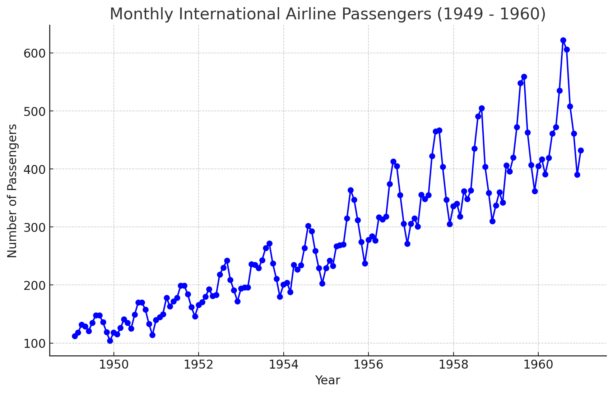

```{r setup, include=FALSE}
library(formatR)
library(knitr)
library(tidyverse)
library(zoo)
knitr::opts_chunk$set(
  comment = NA,
  error = TRUE,
  warning = FALSE,
  tidy = TRUE, 
  fig.align = 'center',
  message = FALSE,
  tidy.opts = list(width.cutoff = 60),
  fig.width = 4, 
  fig.height = 4
)
```


# Introduction

## Course Objective

**Course Objective:** Understanding the key concepts of time series,
summary statistics, trends, and visual representation.

## Key Skills

-   Retrieving summary statistics for time series data

-   Recognizing trends in time series

-   Using window functions to focus on specific time periods

-   Imputing missing values with constant fill, LOCF (Last Observation
    Carried Forward), and linear interpolation

## Let's get started

*What Is Time Series Data?*

## What is Time Series Data?

Let's begin by defining a *time series*.

-   A **time series** is a collection of data points ordered
    sequentially over time.

-   Observations are recorded at regular intervals (e.g., daily,
    monthly, yearly).

## What is Time Series Data?

-   Time series datasets are ubiquitous in the real world – a time
    series analysis studies how **a variable changes over time**, rather
    than **only measuring the variable at different points** in time.

## What is Time Series Data?

-   Let's look at some real-world uses of time series!

## What is Time Series Data?

-   One field that makes frequent use of time series data is *marketing
    and analytics* — for example, the monthly count of passengers in an
    international airline.

## What is Time Series Data?

{width="400px"}

## What is a time series?

-   Another example is **finance** — the closing price of a particular
    stock market each business day.

## What is Time Series Data?

{width="400px"}

## What is a time series?

-   There's also **scientific research** — this last graph shows the
    concentration of carbon dioxide in the atmosphere over time.

## What is Time Series Data?

{width="400px"}

## Time Series Overview

-   The first step in time series analysis is visualizing the dataset.

-   The `print()` function:

-   Displays the **Start**, **End**, and **Frequency** of your data.

-   Also shows the observations.

## Checking Dataset Size

-   Use `length()` to get the total number of observations.

-   Ideal for long datasets where full preview is unnecessary.

## Previewing Subsets

-   For subset previews, use:

-   $head(data, n=)$ to view the first `n` elements.

-   $tail(data, n=)$ to view the last `n` elements.

## Example: Nile Dataset

```{r, eval=FALSE}
print(Nile)
```

## Example: Nile Dataset

```{r, echo=FALSE}
print(Nile)
```

## Previewing Subsets

\`- The **Nile** dataset contains annual streamflow data.

-   `print(Nile)` output:
    -   **Start** = 1871 (first observation year).
    -   **End** = 1970 (last observation year).

## Number of Observations

-   Use `length()` to list the number of observations.

```{r}
length(Nile)
```


## Previewing Data: First 10 Elements

-   Use `head()` to display the first 10 elements of the Nile dataset.

```{r}
head(Nile, n = 10)
```

## Previewing Data: Last 12 Elements

-   Use `tail()` to display the last 12 elements of the dataset.

```{r}
tail(Nile, n = 12)
```

## Time series in R

Here's a plot of AirPassengers, representing passengers in thousands.

{width="400px"}

## Summary statistics

-   Our dataset tracks monthly passengers from January 1949 to December
    1960.

-   The first observation has 112 thousand passengers, the next has 118
    thousand, and so on.

## Summary statistics

Let's get some more information about the dataset.

-   Calling the **summary** function, we get some summary statistics
    about the dataset, including the mean, median, and quartiles.

## Summary statistics

```{r, eval=FALSE}
summary(AirPassengers)
```

## Summary statistics

```{r, echo=FALSE}
summary(AirPassengers)
```

## Exploring Time Series Data

-   Commands like `summary()`, `print()`, `length()`, `head()`, and
    `tail()` help explore raw time series data.

-   A more visual approach to data exploration is plotting.

## Example: AirPassengers Dataset

-   Monthly total international airline passengers (in thousands) from
    **1949 to 1960**.

## Plotting with autoplot

\scriptsize

```{r, eval=FALSE}
library(ggfortify)
autoplot(AirPassengers, ts.colour = 'red', ts.linetype = 'dashed')
```

## Plotting with autoplot

```{r, echo=FALSE}
library(ggfortify)
autoplot(AirPassengers, ts.colour = 'red', ts.linetype = 'dashed')
```

## Practice

Generate an autoplot of the **co2** time series.

## Solution

\scriptsize

```{r, eval=FALSE}
library(ggfortify)
autoplot(co2, ts.colour = 'red', ts.linetype = 'dashed')
```

## Solution

```{r, echo=FALSE}
library(ggfortify)
autoplot(co2, ts.colour = 'red', ts.linetype = 'dashed')
```

## Practice

Create a second autoplot, using the minimal theme from ggplot2

## Solution

\scriptsize

```{r, eval=FALSE}
library(ggfortify)
autoplot(co2, ts.colour = 'red', ts.linetype = 'dashed') + theme_minimal()
```

## Solution

```{r, echo=FALSE}
library(ggfortify)
autoplot(co2, ts.colour = 'red', ts.linetype = 'dashed') + theme_minimal()
```

## Practice

Return the summary statistics from the **co2** time series.

## Solution

\scriptsize

```{r, eval=FALSE}
# Determine the summary statistics of co2
summary(co2)
```

## Solution

```{r, echo=FALSE}
# Determine the summary statistics of co2
summary(co2)
```

## Practice

-   When visualizing time series data, it is vital to be able to
    interpret the different features and attributes of the plots of your
    data.

-   Determining the properties of your data from a plot allows you to
    better prepare the tools needed in your analysis.

-   In this exercise, you'll interpret some of the properties of the
    **ftse** time series, based on its plot.

## Practice

{width="400px"}

## True or False

The axis labeled 'Index' provides the time of each observation.

## True or False

Within each year, there is only a single observation of data.

## True or False

This plot shows an upwards trend in the data

## True or False

There is little 'noise' in the data; the plot is very smooth line

## True or False

The average value of data is approximately 3500

## True or False

The smallest value of data is approximately 5000

## Plotting with autoplot

\scriptsize

```{r, eval=FALSE}
library(ggfortify)
autoplot(AirPassengers, ts.colour = 'red', ts.linetype = 'dashed')
```

## Plotting with autoplot

```{r, echo=FALSE}
library(ggfortify)
autoplot(AirPassengers, ts.colour = 'red', ts.linetype = 'dashed')
```

## Practice

Generate an autoplot of the **co2** time series.

## Solution

\scriptsize

```{r, eval=FALSE}
library(ggfortify)
autoplot(co2, ts.colour = 'red', ts.linetype = 'dashed')
```

## Solution

```{r, echo=FALSE}
library(ggfortify)
autoplot(co2, ts.colour = 'red', ts.linetype = 'dashed')
```

## Practice

Create a second autoplot, using the minimal theme from ggplot2

## Solution

\scriptsize

```{r, eval=FALSE}
library(ggfortify)
autoplot(co2, ts.colour = 'red', ts.linetype = 'dashed') + theme_minimal()
```


## Solution

```{r, echo=FALSE}
library(ggfortify)
autoplot(co2, ts.colour = 'red', ts.linetype = 'dashed') + theme_minimal()
```

## Practice

Return the summary statistics from the **co2** time series.

## Solution

\scriptsize

```{r, eval=FALSE}
# Determine the summary statistics of co2
summary(co2)
```

## Solution

```{r, echo=FALSE}
# Determine the summary statistics of co2
summary(co2)
```

## Practice

-   When visualizing time series data, it is vital to be able to
    interpret the different features and attributes of the plots of your
    data.

-   Determining the properties of your data from a plot allows you to
    better prepare the tools needed in your analysis.

-   In this exercise, you'll interpret some of the properties of the
    **ftse** time series, based on its plot.

## Practice

{width="400px"}

## True or False

The axis labeled 'Index' provides the time of each observation.

## True or False

Within each year, there is only a single observation of data.

## True or False

This plot shows an upwards trend in the data

## True or False

There is little 'noise' in the data; the plot is very smooth line

## True or False

The average value of data is approximately 3500

## True or False

The smallest value of data is approximately 5000

# Sampling frequency

## Additional Operations on Time Series Data

-   Beyond visualization, time series analysis involves several
    operations:
    -   **start()**: returns time index of the first observation.
    -   **end()**: returns time index of the last observation.
    -   **time()**: computes vector of time indices for the entire
        series.

## Time Interval & Frequency Functions

-   **deltat()**: Returns the fixed time interval between observations.
-   **frequency()**: Number of observations per unit time.
-   **cycle()**: Position of each observation in the cycle.

## Example: AirPassengers Dataset

**AirPassengers** dataset reports monthly airline passengers (in
thousands) from 1949 to 1960.

## Example: AirPassengers Dataset

```{r, eval=FALSE}
# Plot AirPassengers data
autoplot(AirPassengers)
```

## Example: AirPassengers Dataset

```{r, echo=FALSE}
# Plot AirPassengers data
autoplot(AirPassengers)
```

## Sampling frequency: exact

-   Some time series data is exactly evenly spaced.

-   For example, hourly temperature measurements for every hour in a
    day.

## Sampling frequency: approximate

-   Some time series data is only approximately evenly spaced.

-   For example, temperature measurements recorded every time you check
    your email.

## Sampling frequency: missing values

-   Some time series data is evenly spaced, but with missing values.

-   For example, hourly temperature measurements while you are awake.

## Basic assumptions

The analysis of time series data proceeds with some simplifying
assumptions:

-   The first assumption is that consecutive observations are equally
    spaced.

-   Secondly, a discrete-time observation index is applied.

## Basic assumptions

-   In practice, this may only hold approximately, and sometimes data
    may be missing.

-   For example, daily log returns on a stock may only be available for
    weekdays, and data may not be available for certain holidays.

-   Monthly CPI (Consumer Price Index) values are equally spaced by
    month, but not by days.

## Sampling frequency: R functions

-   You can apply the **start()** function to the hourly temperature
    measurements series to confirm that it begins on day one at hour
    one.

-   Similarly, applying the **end()** function confirms that the series
    last observation is on day one at hour 24.

## Sampling frequency: R functions

```{r}
# View the start and end dates of AirPassengers
start(AirPassengers)
end(AirPassengers)
```


## Sampling frequency: R functions

-   The **frequency()** function reports that 24 observations are made
    each day, and the **deltat()** function notes that observations are
    made every $0.0417$ days, that is, the time increment between
    observations is 1 over 24.

## Sampling frequency: R functions

```{r}
# Use time(), deltat(), frequency(), and cycle() with AirPassengers 
deltat(AirPassengers)
```

## Sampling frequency: R functions

\scriptsize

```{r}
# Use time(), deltat(), frequency(), and cycle() with AirPassengers 
frequency(AirPassengers)
```

## Sampling frequency: R functions

\scriptsize

```{r}
# Use time(), deltat(), frequency(), and cycle() with AirPassengers 
time(AirPassengers)
```

## Sampling frequency: R functions

\scriptsize

```{r}
# Use time(), deltat(), frequency(), and cycle() with AirPassengers 
cycle(AirPassengers)
```


## Missing values

-   Sometimes there are missing values in time series data, denoted
    **NA** in R, and it is useful to know their locations.

-   It is also important to know how missing values are handled by
    various R functions.

## Missing values

Sometimes we may want to ignore any missingness, but other times we may
wish to impute or estimate the missing values.

## Missing values

-   Let's again consider the monthly **AirPassengers** dataset, but now
    the data for the year **1956** are missing.

## Missing values

-   Let's use **plot()** to display a simple plot of **AirPassengers**.

    -   Note the missing data for 1956.
    
    
## Missing values

```{r, cache= TRUE, eval=FALSE}
# Get the time index for AirPassengers
time_index <- time(AirPassengers)

# Set the data for the year 1956 to NA
AirPassengers[which(floor(time_index) == 1956)] <- NA

# Plot the AirPassengers data
plot(AirPassengers)
```

## Missing values

```{r, cache= TRUE, echo=FALSE}
# Get the time index for AirPassengers
time_index <- time(AirPassengers)

# Set the data for the year 1956 to NA
AirPassengers[which(floor(time_index) == 1956)] <- NA

# Plot the AirPassengers data
plot(AirPassengers)
```

## Missing values

-   We'll explore the implications of this missing data and impute some
    new data to solve the problem.

## Missing values

-   The **mean()** function calculates the sample mean, but it fails in
    the presence of any **NA** values.

-   We use \*\*mean(\_\_\_, na.rm = TRUE)\*\* to calculate the mean with
    all missing values removed.

## Missing values

```{r, cache=TRUE}
# Compute the mean of AirPassengers without using na.rm
mean(AirPassengers)
# Compute the mean of AirPassengers using na.rm
mean(AirPassengers, na.rm = TRUE)
```    


## Missing values

-   It is common to replace missing values with the mean of the observed
    values.

## Missing values

```{r,cache=TRUE, eval=FALSE}
# Impute mean values to NA in AirPassengers
AirPassengers[85:96] <- mean(AirPassengers, na.rm = TRUE)
# Generate another plot of AirPassengers
plot(AirPassengers)
```

## Missing values

```{r,cache=TRUE, echo=FALSE}
# Impute mean values to NA in AirPassengers
AirPassengers[85:96] <- mean(AirPassengers, na.rm = TRUE)
# Generate another plot of AirPassengers
plot(AirPassengers)
```

## Missing values

*Does this simple data imputation scheme appear adequate when applied
the the AirPassengers dataset?*

Based on our plot, it seems that simple data imputation using the mean
is not a great method to approximate what's really going on in the
AirPassengers data.


## Missing values

```{r,cache=TRUE, eval=FALSE}
# Impute mean values to NA in AirPassengers
AirPassengers[85:96] <- mean(AirPassengers, na.rm = TRUE)

# Generate another plot of AirPassengers
plot(AirPassengers)

# Add the complete AirPassengers data to your plot
rm(AirPassengers)
points(AirPassengers, type = "l", col = 2, lty = 3)
```

## Missing values

```{r,cache=TRUE, echo=FALSE}
# Impute mean values to NA in AirPassengers
AirPassengers[85:96] <- mean(AirPassengers, na.rm = TRUE)

# Generate another plot of AirPassengers
plot(AirPassengers)

# Add the complete AirPassengers data to your plot
rm(AirPassengers)
points(AirPassengers, type = "l", col = 2, lty = 3)

```

# Time Series objects

## Basic time series objects

A time series is more than a vector of numbers, it also includes *the
time indices* for each observation.

## Building ts() objects

-   Start with a vector of numbers

-   Apply the **ts()** function to create a time series object.

-   Such objects are of the `ts` class.

-   They represent data that is at least approximately evenly spaced
    over time.

## Building ts() objects

-   Consider the following $data\_vector$ which has just eight
    observations.

## Example

```{r}
data_vector <- c(10,6,11, 8, 10, 3, 6, 9)
data_vector
```

## Building ts() objects

To make this vector a time series object you apply the **ts()** function
When you plot the result using the **plot()** function the time index
and label is automatically added to the horizontal axis.

## Example

```{r, eval=FALSE}
time_series <- ts(data_vector)
plot(time_series)
```


## Example

```{r, echo=FALSE}
time_series <- ts(data_vector)
plot(time_series)
```

## Building ts() objects

By default, R uses a simple observation index starting from 1 as the
time index.

## Building ts() objects

If you want the time series to start in the year 2001 with 1 observation
per year you should apply the ts() function with the additional
arguments $start = 2001$ and $frequency = 1$ as shown.


## Example

```{r, eval=FALSE}
time_series <- ts(data_vector, start = 2001, frequency = 1)
plot(time_series)
```

## Example

Now when you plot the result you can see an updated time axis, running
from 2001 through 2008.

## Example

```{r, echo=FALSE}
time_series <- ts(data_vector, start = 2001, frequency = 1)
plot(time_series)
```

## Using is.ts()

-   You can use the function **is.ts()** to check whether a given object
    is a time series.

## Example

```{r}
is.ts(data_vector)
is.ts(time_series)
```

## Using is.ts()

As you can see, it reports **FALSE** for the **data_vector** and
**true** for the **time_series** that were just created.

## Why ts() objects?

Why do you want to create and work with time series objects of the
**ts** class?

-   Improved plotting

-   Access to time index information

-   Model estimation and forecasting

# Components of a time series

## Components of a time series

A time series can be considered composed of 4 main parts:

**1. trend**

**2. cycle**,

**3. seasonality**

**4. irregular** or remainder/residual part.

## Time Series Trends: No Clear Trend

-   Some time series data do not exhibit any clear or consistent trend
    over time.

-   They fluctuate around a constant mean, with no obvious increase or
    decrease.

-   **Example**:

    -   Random fluctuations over time without a specific direction.

## Time Series Trends: No Clear Trend

```{r, eval=FALSE}
# Simulating no clear trend
ts_data <- rnorm(200)
plot(ts_data, type = "l", main = "No Clear Trend Over Time")
```


## Time Series Trends: No Clear Trend

```{r, echo=FALSE}
# Simulating no clear trend
ts_data <- rnorm(200)
plot(ts_data, type = "l", main = "No Clear Trend Over Time")
```

## Time Series Trends: Linear

-   A **linear trend** is a consistent increase or decrease over time.

-   This type of trend is represented by a straight line when plotted.

-   **Example**:

    -   Data increases or decreases at a constant rate over time.

## Time Series Trends: Linear

\scriptsize

```{r, eval=FALSE}
# Simulating linear trend
time <- 1:200
linear_trend <- 0.05 * time
plot(linear_trend, type = "l", main = "Linear Trend Over Time")
```


## Time Series Trends: Linear

```{r, echo=FALSE}
# Simulating linear trend
time <- 1:200
linear_trend <- 0.05 * time
plot(linear_trend, type = "l", main = "Linear Trend Over Time")
```

## Time Series Trends: Rapid Growth

-   **Rapid growth trends** refer to exponential-like increases over
    time.

-   These trends grow quickly after a certain point.

-   **Example**:

    -   A rapid increase in a dataset, such as population growth.

## Time Series Trends: Rapid Growth

\scriptsize

```{r, eval=FALSE}
# Simulating rapid growth
time <- 1:200
rapid_growth <- exp(0.03 * time)
plot(rapid_growth, type = "l", main = "Rapid Growth Trend Over Time")
```

## Time Series Trends: Rapid Growth

```{r, echo=FALSE}
# Simulating rapid growth
time <- 1:200
rapid_growth <- exp(0.03 * time)
plot(rapid_growth, type = "l", main = "Rapid Growth Trend Over Time")
```

## Time Series Trends: Periodic

-   **Periodic trends** are repeated patterns that recur over time.

-   Typically represented as sinusoidal or oscillating movements.

-   **Example**:

    -   Seasonal changes in temperature or sales cycles.

## Time Series Trends: Periodic

\scriptsize

```{r, eval=FALSE}
# Simulating periodic trend
time <- 1:200
periodic_trend <- sin(0.1 * time)
plot(periodic_trend, type = "l", main = "Periodic Trend Over Time")
```

## Time Series Trends: Periodic

```{r, echo=FALSE}
# Simulating periodic trend
time <- 1:200
periodic_trend <- sin(0.1 * time)
plot(periodic_trend, type = "l", main = "Periodic Trend Over Time")
```

## Time Series Trends: Variance

-   Some time series exhibit increasing or decreasing **variance** over
    time.

-   This means the spread or volatility of the data changes as time
    progresses.

-   **Example**:

    -   Financial time series where volatility increases over time.

## Time Series Trends: Variance

\scriptsize

```{r, eval=FALSE}
# Simulating increasing variance
time <- 1:200
increasing_variance <- time * rnorm(200)
plot(increasing_variance, type = "l", main = "Increasing Variance Over Time")
```

## Time Series Trends: Variance

```{r, echo=FALSE}
# Simulating increasing variance
time <- 1:200
increasing_variance <- time * rnorm(200)
plot(increasing_variance, type = "l", main = "Increasing Variance Over Time")
```

## Why Use Sample Transformations?

**Simplify Data**:

-   Some time series exhibit complex patterns like exponential growth,
    periodic trends, or increasing variance.

-   Transformations can simplify these patterns, making analysis easier.

## Why Use Sample Transformations?

**Make Data Stationary**:

-   Many time series models require data to be stationary (constant
    mean, variance, and covariance).

-   Transformations such as differencing or logging help achieve
    stationarity.

## Why Use Sample Transformations?

**Remove Trends**:

-   By removing linear or seasonal trends, transformations allow us to
    focus on the true underlying behavior of the data, such as
    fluctuations or noise.

-   **Stabilize Variance**: Transformations like logarithms can help
    stabilize variance in cases where the spread of data changes over
    time, improving the accuracy of models.

## Why Use Sample Transformations?

**Improve Interpretability**:

-   Transformed data often reveals clearer insights and patterns, aiding
    better decision-making and predictions.

## Sample Transformations: Log()

-   The **log()** transformation can linearize data with rapid growth.

-   By taking the logarithm of values, rapid exponential growth becomes
    more linear.

-   **Use case**:

    -   Suitable for data with exponential growth patterns, such as
        financial data.

## Sample Transformations: Log()

\scriptsize

```{r, eval=FALSE}
# Log transformation to linearize rapid growth
rapid_growth <- exp(0.05 * time)
log_transformed <- log(rapid_growth)
plot(log_transformed, type = "l", main = "Log-Transformed Rapid Growth")
```

## Sample Transformations: Log()

```{r, echo=FALSE}
# Log transformation to linearize rapid growth
rapid_growth <- exp(0.05 * time)
log_transformed <- log(rapid_growth)
plot(log_transformed, type = "l", main = "Log-Transformed Rapid Growth")
```

## Sample Transformations: Diff()

-   The **diff()** function computes the difference between successive
    values.

-   The first difference transformation of a time series $z_t$ consists
    of the differences (changes) between successive observations over
    time, that is:

$$
\Delta z_t = z_t - z_{t-1}
$$

where $\Delta z_t$ represents the first difference at time $t$.

-   This can help remove linear trends, making data easier to analyze.

-   **Use case**:

    -   Often used in financial data to remove trends and focus on
        changes over time.

## Sample Transformations: Diff()

\scriptsize

```{r, eval=FALSE}
# Differencing to remove linear trend
linear_trend <- 0.05 * time
differenced_data <- diff(linear_trend)
plot(differenced_data, type = "l", main = "Differenced Data")
```

## Sample Transformations: Diff()

```{r, echo=FALSE}
# Differencing to remove linear trend
linear_trend <- 0.05 * time
differenced_data <- diff(linear_trend)
plot(differenced_data, type = "l", main = "Differenced Data")
```

-   By removing the long-term time trend, you can view the amount of
    change from one observation to the next.

## Sample Transformations: Seasonal Differencing

-   **Seasonal differencing** removes periodic trends by differencing
    the series at seasonal intervals.

    -   Helps focus on variations within the same cycle.

-   **Use case**:

    -   Used when data shows clear seasonal or cyclical patterns, such
        as monthly sales.


## Sample Transformations: Seasonal Differencing

-   The function \texttt{diff(..., lag = s)} will calculate the lag $s$
    difference or length $s$ seasonal change series.

-   For monthly or quarterly data, an appropriate value of $s$ would be
    12 or 4, respectively.

-   The \texttt{diff()} function has $\texttt{lag = 1}$ as its default
    for first differencing.

-   Similar to before, a seasonally differenced series will have $s$
    fewer observations than the original series.

## Sample Transformations: Seasonal Differencing

\small

```{r, eval=FALSE}
# Create a sample time series 'x' to use in seasonal differencing
x <- ts(rnorm(100), frequency = 12)  # Simulate a monthly time series with 100 observations
# Seasonal differencing with lag = 4
dx <- diff(x, lag = 4)
ts.plot(dx)
```

## Sample Transformations: Seasonal Differencing

```{r, echo=FALSE}
# Create a sample time series 'x' to use in seasonal differencing
x <- ts(rnorm(100), frequency = 12)  # Simulate a monthly time series with 100 observations
# Seasonal differencing with lag = 4
dx <- diff(x, lag = 4)
ts.plot(dx)
```

-   **Key point**: The differenced series has `s` fewer observations
    than the original.

## White Noise (WN) Model

White noise is the simplest example of a stationary process. A weak
white noise (WN) process has the following characteristics:

-   A fixed, constant mean.
-   A fixed, constant variance.
-   No correlation over time.

## Simulating the White Noise Model

-   The white noise (WN) model is a basic time series model and serves
    as the foundation for more elaborate models.

-   We will focus on the simplest form of WN, where the data are
    independent and identically distributed (iid).

## Simulating the White Noise Model

-   The \texttt{arima.sim()} function can be used to simulate data from
    various time series models.

-   \texttt{ARIMA} is an abbreviation for
    \textit{autoregressive integrated moving average}, a class of models
    that needs to be studied in detail.

## Simulating the White Noise Model

An \texttt{ARIMA(p, d, q)} model has three components:

-   $p$: The autoregressive order.
-   $d$: The order of integration (or differencing).
-   $q$: The moving average order.


## ARIMA Model Components

An \texttt{ARIMA(p, d, q)} model has three key components:

-   $p$: The autoregressive order
-   $d$: The order of integration (or differencing)
-   $q$: The moving average order

## Explanation

The ARIMA model is used to predict time series data, taking into account
the past values, trends, and errors. Let's break down each of its
components:


## Autoregressive (AR) Order

-   **Definition**: The number of past observations used to predict the
    current value.

-   **Explanation**: If $p = 2$, the model uses the last two values of
    the series to predict the next one.

It's similar to saying, "Today's value depends on the last two values."

$$
X_t = \alpha + \beta_1 X_{t-1} + \beta_2 X_{t-2} + \epsilon_t
$$

## Differencing Order

-   **Definition**: The number of times the data has been differenced to
    make it stationary.

-   **Explanation**: Differencing removes trends to stabilize the data.

    -   If $d = 1$, the model looks at changes between consecutive
        values instead of raw data.

For example, subtracting $X_{t-1}$ from $X_t$:

$$
\Delta X_t = X_t - X_{t-1}
$$

## Moving Average (MA) Order

-   **Definition**: The number of past errors used to predict the
    current value.

-   **Explanation**: The model uses past forecast errors to adjust the
    current prediction.

    -   If $q = 1$, it uses the last error to improve today's forecast.

$$
X_t = \mu + \epsilon_t + \theta_1 \epsilon_{t-1}
$$

## Example of ARIMA(1,1,1)

This would indicate:

-   $p = 1$: Use the last value for prediction.

-   $d = 1$: Use the first difference of the series.

-   $q = 1$: Use the last forecast error.

$$
\Delta X_t = \alpha + \beta X_{t-1} + \epsilon_t + \theta \epsilon_{t-1}
$$

## Simulating the White Noise Model

-   In this exercise, we focus on the simplest model,
    \texttt{ARIMA(0, 0, 0)}, where all parameters are set to zero.

-   This corresponds to a white noise model.

## White Noise (WN) Model

\small

```{r, eval=FALSE}
# Simulate WN model
white_noise <- arima.sim(model = list(order = c(0, 0, 0)), n = 100)
ts.plot(white_noise)
```

## White Noise (WN) Model

```{r, echo=FALSE}
# Simulate WN model
white_noise <- arima.sim(model = list(order = c(0, 0, 0)), n = 100)
ts.plot(white_noise)
```

-   **Key point**: WN is the foundation for more complex time series
    models.

## Simulating White Noise with Mean and Variance

-   White noise can be generated with a specific mean and variance.

\small

```{r, eval=FALSE}
# Simulate WN with mean = 100, sd = 10
white_noise_2 <- arima.sim(model = list(order = c(0, 0, 0)), n = 100, mean = 100, sd = 10)
ts.plot(white_noise_2)
```

## Simulating White Noise with Mean and Variance

```{r, echo=FALSE}
# Simulate WN with mean = 100, sd = 10
white_noise_2 <- arima.sim(model = list(order = c(0, 0, 0)), n = 100, mean = 100, sd = 10)
ts.plot(white_noise_2)
```

-   **Key point**: Adjust mean and variance to suit your model.

## Model future behavior

-   By fitting a model to the data (e.g., using ARIMA), we can use the
    estimated parameters to make predictions about future observations.

-   For example, estimating parameters for a white noise model allows us
    to predict future values based on the randomness of the process.

## Estimating the White Noise Model

-   **Estimate WN** using $arima()$ with $order = c(0, 0, 0)$.

-   The model estimates the mean (intercept) and variance $(sigma^2)$.

## Estimating the White Noise Model

\small

```{r, eval=FALSE}
# Simulate a white noise series for y
y <- arima.sim(model = list(order = c(0, 0, 0)), n = 100)
# Fit WN model
arima(y, order = c(0, 0, 0))
# Fit WN model
arima(y, order = c(0, 0, 0))
mean(y)
var(y)
```

## Estimating the White Noise Model

\small

```{r, echo=FALSE}
# Simulate a white noise series for y
y <- arima.sim(model = list(order = c(0, 0, 0)), n = 100)
# Fit WN model
arima(y, order = c(0, 0, 0))
# Fit WN model
arima(y, order = c(0, 0, 0))
mean(y)
var(y)
```

-   **Key point**: Compare estimated mean and variance with sample
    statistics.

## Stationary Processes

-   **Stationary models** are parsimonious (balance simplicity and
    explanatory power).

-   **Distributional stability** over time: mean, variance, and
    covariance are constant.

-   **Observed time series**:

    -   Fluctuate randomly.

-   Behave similarly from one time period to the next.

## Non - Stationary Processes

-   A non-stationary process is a time series where statistical
    properties like the mean, variance, or covariance change over time.

-   One of the simplest examples of a non-stationary process is a random
    walk.

## The Random Walk (RW) Model

-   A \textit{random walk} (RW) is a simple example of a non-stationary
    process.

-   A random walk has the following properties:

    -   No specified mean or variance.
    -   Strong dependence over time.
    -   Its changes or increments are white noise (WN).

## The Random Walk Recursion

Recursion means that each step in the process depends on the result of
the previous step. In the case of a random walk, it means the current
value $Y_t$ is calculated by adding a random change $\epsilon_t$ to the
previous value $Y_{t-1}$.

$$
Y_t = Y_{t-1} + \epsilon_t
$$

## The Random Walk Recursion

The random walk recursion is given by: $$
\text{Today} = \text{Yesterday} + \text{Noise}
$$ or more formally: $$
Y_t = Y_{t-1} + \epsilon_t
$$ where $\epsilon_t$ is mean zero white noise (WN).

## The Random Walk Recursion

\noindent Simulation requires an initial point $Y_0$ and only one
parameter, the WN variance $\sigma^2_\epsilon$. Since: $$
Y_t - Y_{t-1} = \epsilon_t
$$ the first difference $\text{diff}(Y)$ is white noise.

## Random Walk with Drift

-   A random walk with drift is a random walk where, in addition to the
    random change, there is a constant trend (called "drift").

-   This means that over time, the values tend to move in a particular
    direction (upward or downward) instead of just randomly fluctuating
    around a fixed value.

## Random Walk with Drift

A random walk with drift can be described as: $$
\text{Today} = \text{Constant} + \text{Yesterday} + \text{Noise}
$$ or more formally: $$
Y_t = c + Y_{t-1} + \epsilon_t
$$ where $c$ is the drift (constant), and $\epsilon_t$ is white noise
with variance $\sigma^2_\epsilon$. In this case: $$
Y_t - Y_{t-1} = ?
$$ which means that $\text{diff}(Y)$ is white noise with mean $c$.

## The Random Walk (RW) Model

\small

```{r, eval=FALSE}
# Simulate RW model
random_walk <- arima.sim(model = list(order = c(0, 1, 0)), n = 100)
ts.plot(random_walk)
```

## The Random Walk (RW) Model

```{r, echo=FALSE}
# Simulate RW model
random_walk <- arima.sim(model = list(order = c(0, 1, 0)), n = 100)
ts.plot(random_walk)
```

-   **Key point**: The increments (differences) in a RW are white noise.

## Simulating the Random Walk Model with Drift

-   A random walk (RW) need not wander around zero; it can have an
    upward or downward trajectory, i.e., a drift or time trend.

-   This can be achieved by including an intercept in the RW model,
    which corresponds to the slope of the RW time trend.

## Simulating the Random Walk Model with Drift

For an alternative formulation, you can take the cumulative sum of a
constant mean white noise (WN) series, where the mean corresponds to the
slope of the RW time trend.

## Simulating the Random Walk Model with Drift

-   To simulate data from the RW model with a drift, you can use the
    \texttt{arima.sim()} function with the
    \texttt{model = list(order = c(0, 1, 0))} argument.

-   Additionally, you should include the argument \texttt{mean = ...} to
    specify the drift variable, or the intercept.

## Simulating the Random Walk Model with Drift

-   A **random walk with drift** includes a constant trend.
-   **Formula**: $Y_t = c + Y_{t-1} + \epsilon_t$

## Simulating the Random Walk Model with Drift

\small

```{r, eval=FALSE}
# Simulate RW model with drift
rw_drift <- arima.sim(model = list(order = c(0, 1, 0)), n = 100, mean = 1)
ts.plot(rw_drift)
```

## Simulating the Random Walk Model with Drift

```{r, echo=FALSE}
# Simulate RW model with drift
rw_drift <- arima.sim(model = list(order = c(0, 1, 0)), n = 100, mean = 1)
ts.plot(rw_drift)
```

-   **Key point**: Differencing this series returns white noise.

## Estimating the Random Walk Model

-   To estimate the random walk, first difference the data and fit a
    white noise model.

```{r, eval=FALSE}
# Fit WN model to first differenced RW
rw_diff <- diff(rw_drift)
model_wn <- arima(rw_diff, order = c(0, 0, 0))
```

## Estimating the Random Walk Model

```{r, echo=FALSE}
# Fit WN model to first differenced RW
rw_diff <- diff(rw_drift)
model_wn <- arima(rw_diff, order = c(0, 0, 0))
```

-   **Key point**: The estimated drift (intercept) is shown in the model
    output.

## Visualizing the Random Walk with a Time Trend

**Goal**: Visualize the estimated time trend (drift) in the random walk
data.

```{r, eval=FALSE}
# Plot RW data and add time trend
ts.plot(rw_drift)
abline(0, model_wn$coef[1])  # Add time trend line
```

## Visualizing the Random Walk with a Time Trend

```{r, echo=FALSE}
# Plot RW data and add time trend
ts.plot(rw_drift)
abline(0, model_wn$coef[1])  # Add time trend line
```

-   **Key point**: The time trend line matches the drift estimated from
    the model.

## Weak Stationarity

-   A process $Y_1, Y_2, \dots$ is **weakly stationary** if:

-   Mean $\mu$ of $Y_t$ is constant for all $t$.

-   Variance $\sigma^2$ of $Y_t$ is constant for all $t$.

-   Covariance of $Y_t$ and $Y_s$ depends only on $|t - s| = h$.

## Weak Stationarity

```{r, eval=FALSE}
# Example covariance
cov(Y_3, Y_7) = cov(Y_7, Y_11)
```

## Stationarity: When?

-   Financial time series often not stationary, but changes are
    approximately stationary.

-   Stationary series oscillates around a fixed level (mean-reversion).

-   White noise (WN) is stationary, random walk (RW) is not.

## Stationarity Simulation

\small

```{r, eval=FALSE}
# White noise simulation
white_noise <- arima.sim(model = list(order = c(0, 0, 0)), n = 100)
# Random walk from white noise
random_walk <- cumsum(white_noise)
# White noise with drift
wn_drift <- arima.sim(model = list(order = c(0, 0, 0)), n = 100, mean = 0.4)
# Random walk with drift
rw_drift <- cumsum(wn_drift)
# Plot
plot.ts(cbind(white_noise, random_walk, wn_drift, rw_drift))
```

## Stationarity Simulation

```{r, echo=FALSE}
# White noise simulation
white_noise <- arima.sim(model = list(order = c(0, 0, 0)), n = 100)
# Random walk from white noise
random_walk <- cumsum(white_noise)
# White noise with drift
wn_drift <- arima.sim(model = list(order = c(0, 0, 0)), n = 100, mean = 0.4)
# Random walk with drift
rw_drift <- cumsum(wn_drift)
# Plot
plot.ts(cbind(white_noise, random_walk, wn_drift, rw_drift))
```

## The Goal of Investing

Goal of Investing:

-   To make a profit.

Profit depends on:

-   Amount invested

## Changes in prices

Asset returns measure:

-   Changes in price as a fraction of the initial price.

Calculated over a given time horizon (e.g., one business day).

## What are Financial Returns?

-   Financial returns are a way to measure profit or loss.

-   They show how much the price of an asset has changed.

-   Common time frames: daily, weekly, monthly.

## EU Stocks Dataset

-   $eu\_stocks$ reports index values (prices).

-   Indices are not investable but many assets (like mutual funds) track
    them.

## Asset Prices vs. Returns

-   Prices show the value of an asset at a given time.

-   Returns show how much the price has changed relative to its starting
    value.

## Log Returns

-   Log returns are also called continuously compounded returns.

-   They simplify multi-period calculations.

$$Log returns = log of gross returns$$

## Prices and Returns in eu_stocks

\small

```{r, eval=FALSE}
eu_stocks <- EuStockMarkets
# Convert prices to returns
returns <- eu_stocks[-1,] / eu_stocks[-nrow(eu_stocks),] - 1
returns <- ts(returns, start = c(1991, 130), frequency = 260)
# Plot returns
plot(returns)
```

## Prices and Returns in eu_stocks

```{r, echo=FALSE}
eu_stocks <- EuStockMarkets
# Convert prices to returns
returns <- eu_stocks[-1,] / eu_stocks[-nrow(eu_stocks),] - 1
returns <- ts(returns, start = c(1991, 130), frequency = 260)
# Plot returns
plot(returns)
```

## Prices and Returns in eu_stocks

```{r, eval=FALSE}
# Log returns
logreturns <- diff(log(eu_stocks))
# Plot log returns
plot(logreturns)
```

## Prices and Returns in eu_stocks

```{r, echo=FALSE}
# Log returns
logreturns <- diff(log(eu_stocks))
# Plot log returns
plot(logreturns)
```

## Financial Time Series Characteristics

-   Small daily returns, close to zero average.

-   Large variances and occasional extreme returns (outliers).

-   Heavy-tailed, non-normal distribution.

## Statistical Summary of Returns

```{r, eval=FALSE}
eu_percentreturns <- returns * 100
# Means, Variance, SD
colMeans(eu_percentreturns)
apply(eu_percentreturns, MARGIN = 2, FUN = var)
apply(eu_percentreturns, MARGIN = 2, FUN = sd)
```

## Statistical Summary of Returns

```{r, echo=FALSE}
eu_percentreturns <- returns * 100
# Means, Variance, SD
colMeans(eu_percentreturns)
apply(eu_percentreturns, MARGIN = 2, FUN = var)
apply(eu_percentreturns, MARGIN = 2, FUN = sd)
```

## Statistical Summary of Returns

```{r, eval=FALSE}
# Histograms and Quantile plots
par(mfrow = c(2,2))
apply(eu_percentreturns, 2, hist)
apply(eu_percentreturns, 2, qqnorm); qqline(eu_percentreturns)
```

## Statistical Summary of Returns

\small

```{r, echo=FALSE}
# Histograms and Quantile plots
par(mfrow = c(2,2))
apply(eu_percentreturns, 2, hist)
apply(eu_percentreturns, 2, qqnorm); qqline(eu_percentreturns)
```

## Scatterplots: Asset Prices vs Log Returns

-   Scatterplots: relationship between pairs of time series.

-   Log returns often show elliptical patterns in pairs.

## Scatterplots: Asset Prices vs Log Returns

```{r, eval=FALSE}
# Scatterplot of DAX and FTSE
plot(eu_stocks[,'DAX'], eu_stocks[,'FTSE'])
```

## Scatterplots: Asset Prices vs Log Returns

```{r, echo=FALSE}
# Scatterplot of DAX and FTSE
plot(eu_stocks[,'DAX'], eu_stocks[,'FTSE'])
```

## Scatterplots: Asset Prices vs Log Returns

```{r, eval=FALSE}
# Scatterplot matrix
pairs(eu_stocks)
pairs(logreturns)
```

## Scatterplots: Asset Prices vs Log Returns

```{r, echo=FALSE}
# Scatterplot matrix
pairs(eu_stocks)
pairs(logreturns)
```

## Covariance and Correlation

-   Covariance: relationship between variables, scale-dependent.

-   Correlation: standardized covariance, ranges [-1, 1].

## Covariance and Correlation

```{r, eval=FALSE}
DAX_logreturns <- diff(log(eu_stocks[,'DAX']))
FTSE_logreturns <- diff(log(eu_stocks[,'FTSE']))
# Covariance and correlation
cov(DAX_logreturns, FTSE_logreturns)
cor(DAX_logreturns, FTSE_logreturns)
cor(logreturns)
```

## Covariance and Correlation

```{r, echo=FALSE}
DAX_logreturns <- diff(log(eu_stocks[,'DAX']))
FTSE_logreturns <- diff(log(eu_stocks[,'FTSE']))
# Covariance and correlation
cov(DAX_logreturns, FTSE_logreturns)
cor(DAX_logreturns, FTSE_logreturns)
cor(logreturns)
```

## Autocorrelation: Lag Dependence

Autocorrelation: correlation between values at different lags.

```{r, eval=FALSE}
# Lag-1 autocorrelation manually
x_t0 <- x[-1]; x_t1 <- x[-length(x)]
cor(x_t0, x_t1)
# ACF calculation
acf(x, lag.max = 10, plot = FALSE)
```

## Autocorrelation: Lag Dependence

\small

```{r, echo=FALSE}
# Lag-1 autocorrelation manually
x_t0 <- x[-1]; x_t1 <- x[-length(x)]
cor(x_t0, x_t1)
# ACF calculation
acf(x, lag.max = 10, plot = FALSE)
```

## Autoregressive (AR) Model

$$AR recursion: Today = Slope * Yesterday + Noise$$

Persistence is higher with large slope values.

## Autoregressive (AR) Model

```{r, cache=TRUE}
# Simulate AR models
x <- arima.sim(model = list(ar = 0.5), n = 100)
y <- arima.sim(model = list(ar = 0.9), n = 100)
z <- arima.sim(model = list(ar = -0.75), n = 100)
```

## Autoregressive (AR) Model

```{r, eval=FALSE}
# Plot
plot.ts(cbind(x, y, z))
acf(x); acf(y); acf(z)
```

## Autoregressive (AR) Model

```{r, echo=FALSE}
# Plot
plot.ts(cbind(x, y, z))
acf(x); acf(y); acf(z)
```

## MA vs AR Models

-   MA: short-run dependence, AR: persistent dependence.

-   AIC/BIC help compare model fit (lower values are better).

## Moving Average (MA) Model

MA process: current value depends on current & previous noise.

```{r, cache=TRUE}
# Simulate MA models
x <- arima.sim(model = list(ma = 0.5), n = 100)
y <- arima.sim(model = list(ma = 0.9), n = 100)
z <- arima.sim(model = list(ma = -0.5), n = 100)
```

## Moving Average (MA) Model

```{r, eval=FALSE}
# Plot and ACF
plot.ts(cbind(x, y, z))
acf(x); acf(y); acf(z)
```

## Moving Average (MA) Model

```{r, echo=FALSE}
# Plot and ACF
plot.ts(cbind(x, y, z))
acf(x); acf(y); acf(z)
```

## Forecasting with AR/MA Models

Predict future observations based on AR/MA models.

\small

```{r, eval=FALSE}
AR <- arima(AirPassengers, order = c(1, 0, 0))
# Forecasts from AR model
AR_forecast <- predict(AR, n.ahead = 10)
# Plot with prediction intervals
ts.plot(Nile, xlim = c(1871, 1980))
points(AR_forecast$pred, col = 2)
points(AR_forecast$pred - 2*AR_forecast$se, col = 2, lty = 2)
points(AR_forecast$pred + 2*AR_forecast$se, col = 2, lty = 2)
```

## Forecasting with AR/MA Models

```{r, echo=FALSE}
AR <- arima(AirPassengers, order = c(1, 0, 0))
# Forecasts from AR model
AR_forecast <- predict(AR, n.ahead = 10)
# Plot with prediction intervals
ts.plot(Nile, xlim = c(1871, 1980))
points(AR_forecast$pred, col = 2)
points(AR_forecast$pred - 2*AR_forecast$se, col = 2, lty = 2)
points(AR_forecast$pred + 2*AR_forecast$se, col = 2, lty = 2)
```

## Conclusion

-   Key models: White noise, random walk, AR, MA.

-   Use AIC/BIC to evaluate model fit.

-   Time series tools: arima.sim(), acf(), predict().

## Thank You!

\begin{figure}
        \centering
        \includegraphics[width=0.5\textwidth]{./images/thankyou.jpg} % Resize the image
    \end{figure}

